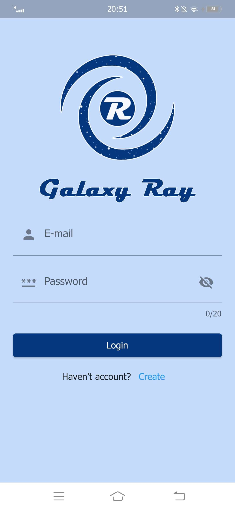
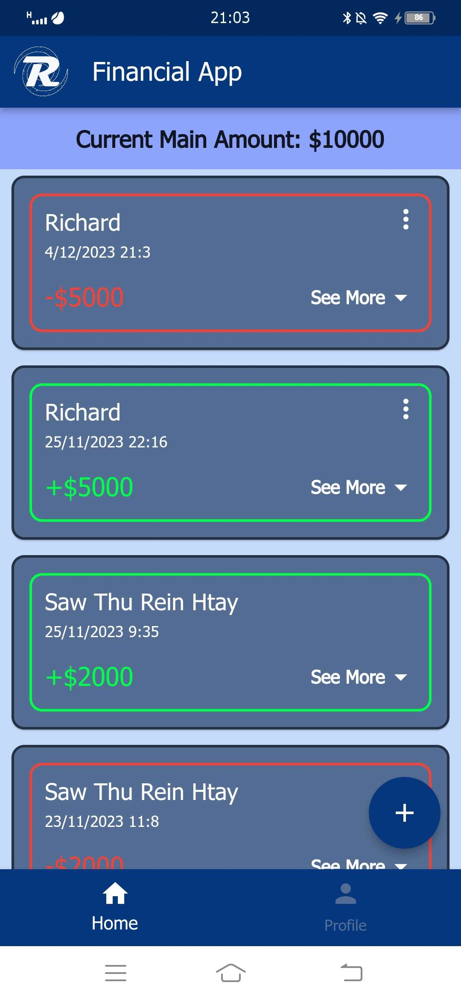
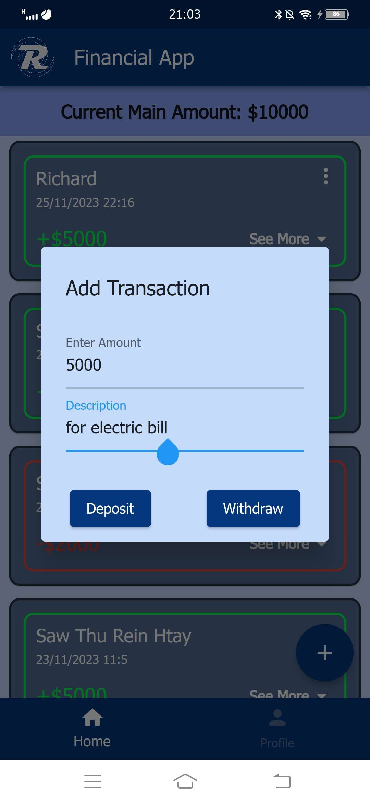

# Small Scale Finance Tracker (Galaxy Ray)

 

  
 

A mobile application developed using Flutter that helps students track shared expenses, deposits, and withdrawals during group activities, trips, and events.

## Overview

Managing shared finances among students can be confusing, especially when collecting money for trips, activities, or class projects. This application allows users to easily record financial transactions and track contributions from different members.

The app was developed as part of my **High National Diploma (HND) mobile development project**.

## Features

- Track deposits and withdrawals
- Record financial contributions from different members
- View transaction history
- Simple and intuitive mobile interface
- Gesture-based controls for faster interaction
- Lightweight and efficient design

## Technologies Used

- Flutter
- Dart
- Mobile UI Development
- Firebase Database(Firestore)

## Screenshots

  
  
  

More screenshots can be found here:

[View all screenshots](screenshots/)

## Project Purpose

This project was designed to demonstrate mobile application development skills including:

- Flutter UI design
- Mobile interaction design
- Financial data tracking
- Gesture-based mobile controls

## Author

Saw Thu Rein Htay  
Email: thureinrichard3@gmail.com
